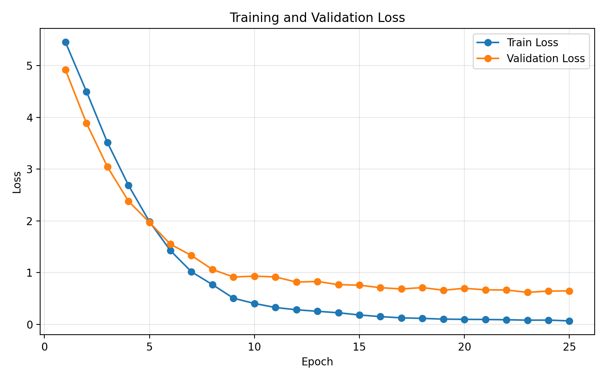
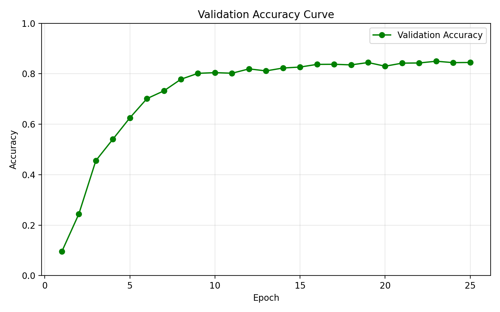
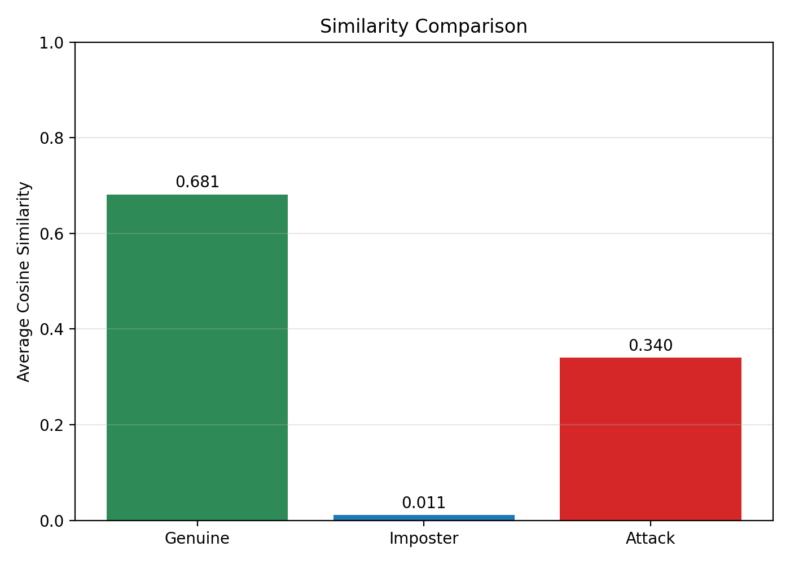

# 🧠 MambaVision-Based Biometric Verification & Vulnerability Analysis

## 📌 Overview

This project implements a biometric identity verification system using a MambaVision backbone trained on forehead images.
The system evaluates identity similarity using cosine similarity of learned embeddings and analyzes robustness against adversarial (E-dataset) inputs.

---

## 🚀 Key Features

- MambaVision-based feature learning (fallback mode)
- Embedding-based identity representation (640-D vectors)
- Cosine similarity for verification
- Genuine vs Imposter comparison
- Attack (E-dataset) vulnerability analysis
- End-to-end pipeline: training -> feature extraction -> evaluation

---

## 📂 Dataset Structure

Each subject contains 20 images:

```text
Subject_i/
  ├── 1.jpg
  ├── ...
  ├── 10.jpg   -> Gallery (reference)
  ├── 11.jpg
  ├── ...
  ├── 20.jpg   -> Probe (query)
```

- Total subjects: 290
- Total images: 5800

---

## ⚙️ Pipeline

### 1) Model Training

- Backbone: MambaVision (fallback mode)
- Input: 224x224 images
- Epochs: 25
- Optimizer: Adam
- Scheduler: Learning rate decay applied

Output:

- Trained model: `best_mamba_model.pth`

---

### 2) Feature Extraction

Each image is converted into a:

```text
640-dimensional embedding vector
```

Command:

```bash
python extract_features.py
```

Output:

```text
features.pt
```

---

### 3) Similarity Computation

Cosine similarity is computed between:

- Genuine pairs (same subject)
- Imposter pairs (different subjects)

Pairing strategy:

```text
Gallery (1-10) vs Probe (11-20)
```

Command:

```bash
python similarity.py
```

---

### 4) Attack Evaluation (E-dataset)

Evaluate robustness using modified images:

```text
Real Gallery vs E-dataset Probe
```

Command:

```bash
python extract_features_e.py
python attack_similarity.py
```

---

## 📊 Results

| Type | Avg Similarity |
|------|----------------|
| Genuine | ~0.681 |
| Imposter | ~0.0108 |
| Attack | ~0.340 |

---

## 📈 Plots

### Loss Curve



### Validation Accuracy Curve



### Similarity Comparison



---

## 📈 Interpretation

- High genuine similarity -> strong identity representation
- Low imposter similarity -> good class separation
- Moderate attack similarity -> partial vulnerability

The model remains robust but is not fully resistant to adversarial inputs.

---

## 🧠 Key Insights

- Embedding-based verification is more flexible than classification
- Cosine similarity effectively separates identities
- Attack data reduces similarity but does not collapse identity recognition
- Verification requires full subject data, not split datasets

---

## 🔮 Future Work

- ROC / FAR / FRR analysis
- Threshold-based decision system
- Grad-CAM visualization
- Robust training against adversarial samples
- Deployable verification system

---

## 💡 How to Run

```bash
# Train model
python train.py

# Extract features (real dataset)
python extract_features.py

# Compute similarity
python similarity.py

# Extract features (E-dataset)
python extract_features_e.py

# Attack evaluation
python attack_similarity.py
```

---

## 📬 Contact / Notes

This project is part of a Deep Learning study on biometric verification systems.
Feedback and suggestions are welcome.
